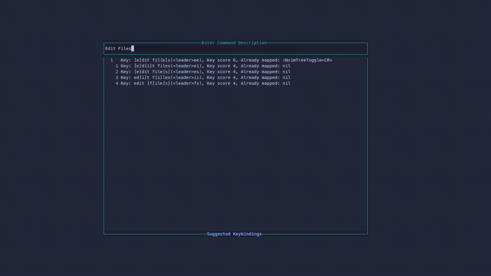

# hawtkeys.nvim

## What is this?
hawtkeys.nvim is a nvim plugin for finding and suggesting memorable and easy to press keys for your nvim shortcuts.
It takes into consideration keyboard layout, easy to press combinations and memorable phrases, and excludes already mapped combinations to provide you with suggested keys for your commands

## Getting Started
Installation instructions to follow, but as usual with package managers

## Usage

```
:lua require("hawtkeys.ui").show()
```

This will allow you to search keybinds as below:

<div align="center">
    
</div>

## Contributing

Contributions are what make the open source community such an amazing place to learn, inspire, and create. Any contributions you make are **greatly appreciated**.

If you have a suggestion that would make this better, please fork the repo and create a pull request. You can also simply open an issue with the tag "enhancement".
Don't forget to give the project a star! Thanks again!

If there is something specific you want to work on then, please open an issue/discussion first to avoid duplication of efforts

Outstanding items are currently in the TODO.md file.

1. Fork the Project
2. Create your Feature Branch (`git checkout -b feature/AmazingFeature`)
3. Commit your Changes (`git commit -m 'Add some AmazingFeature'`)
4. Push to the Branch (`git push origin feature/AmazingFeature`)
5. Open a Pull Request
